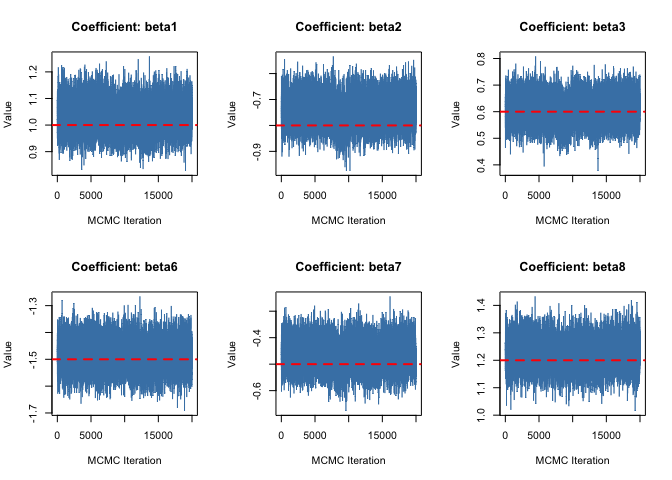
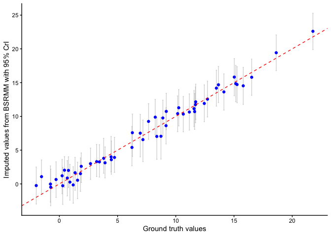

README
================
Kai Jiang

# BSRMM

Bayesian Reduced Rank Regression for Microbiome-Metabolite Data
Integration

**Author**: Kai Jiang  
**Reference**: Jiang K, Saha S, Peterson CB. Bayesian sparse regression
for microbiome-metabolite data integration.

## Overview

This repository provides the implementation of **Bayesian Sparse
Regression for Microbiome-Metabolite Data Integration (BSRMM)**. This
method enables joint modeling of high-dimensional microbiome predictors
and metabolomic outcomes. The BSRMM model is implemented in R and is
designed for variable selection and missing value imputation for
outcomes.

## Directory Structure

- `code/` – Contains scripts to generate simulated datasets and run the
  BSRMM model.
- `data/` – Contains simulated datasets.
- `function` - Contains the implementation of the BSRMM model and
  simulation functions.
- `plot` - Contains MCMC diagnostic plots.
- `result` - Contains the results of the BSRMM model and diagnostic
  R-hat values.

## Example

``` r
setwd("/Users/kjiang/Desktop/BSRMM/")

# functions 
source("./function/bsrmmgibbs.R")
source("./function/bsrmmbf.R")

# required library
library(truncnorm)
library(mvnfast)
library(MASS)
library(coda)
library(MCMCpack)
library(reshape2)
library(knitr)
library(ggplot2)
```

### Import simulated datasets

``` r
# import data 
mydata <- readRDS("./data/low_mnar0.33_ind_300_1000_1_0.3_1.RDS")

# extract predictors and outcomes
predictor <- mydata$X
outcome <- mydata$Y_miss
```

### Check the true nonzero coefficients

``` r
cat("The nonzero coefficients are: ", which(mydata$coeffs[,1] != 0), "\n")
```

    The nonzero coefficients are:  1 2 3 6 7 8 

``` r
cat("The value of the nonzero coefficients are: ", mydata$coeffs[which(mydata$coeffs[,1] != 0),2], "\n")
```

    The value of the nonzero coefficients are:  1 -0.8 0.6 -1.5 -0.5 1.2 

### Split the data into train and test sets, and prepare for BSRMM model fitting

``` r
# consider scale and center the predictor before split
stand <- list()
stand$mux <- colMeans(predictor)
stand$Sx <- apply(predictor, 2, sd)
predictor <- apply(predictor, 2, function(x) (x - mean(x))/sd(x))

# we already performed mean or low missing value imputation during that simulation generation
# we need to re-set the value into zero
index <- which(mydata$Y_miss != mydata$Y_true)
index <- sort(index)
outcome[index] <- 0

# save dt for following prediction error analysis: 0 = miss, 1 = observed
dt <- data.frame(outcome)
dt$Ri <- 0
dt$Ri[which(dt$outcome != 0)] <- 1

# split the data into train and test
set.seed(33)
seed <- 33

train_ind <- sample(nrow(predictor),size = round(0.7*nrow(predictor)),replace = FALSE)
train_ind <- sort(train_ind)
# train_ind

predictor_train <- predictor[train_ind,]
predictor_test <- predictor[-train_ind,]

outcome_train <- outcome[train_ind,]
outcome_test <- outcome[-train_ind,]

dt_train <- dt[train_ind,]
dt_test <- dt[-train_ind,]

X <- as.matrix(predictor_train)

# check the outcome 
Y <- as.matrix(outcome_train)

# preparation for gibbs sampling
n <- nrow(X)
p <- ncol(X)
c <- 100 # larger c to maintain the compositionality of the predictors 

# construct the T matrix, because we cannot assign a matrix to T due to R's limitation 
# we name it as N matrix 
N <- rbind(diag(x = 1, nrow = p, ncol = p), matrix(data = c, nrow = 1, ncol = p))

# number of sampling procedure 
nburnin <- 10000
niter <- 20000

# initial number of predictors 
nop <- floor(n/2)
```

### Construct the Q matrix and initialize the hyperparameters for BSRMM model fitting

``` r
Q <- diag(0,nrow = p) 

# initial hyperparameters 
tau <- 1 
nu <- 0
omega <- 0 

a0 <- -12
a <- rep(a0,p)

predict_result = TRUE
display = FALSE
bayestmetab = TRUE

# save the running time: 
bsrmm <- bsrmmgibbs(nburnin, niter, p, nop, Y, X, N, a, Q, n, tau, nu, omega, 
                    alpha_a_shape = 1, alpha_b_shape = 1, seed, predict_result, bayestmetab, display, lod_ratio = 1)

# Result
PPI <- colMeans(bsrmm$gamma[(nburnin+2):(nburnin+niter+1),]) # posterior probabilities of inclusion
beta_select <- rep(0, ncol(X))
beta_select[which(PPI > 0.5)] <- 1
```

### Check selected predictors vs true nonzero coefficients

    Selection Results:

     - Selected Predictors: 1, 2, 3, 6, 7, 8

     - True Predictors:     1, 2, 3, 6, 7, 8

     - Accuracy: 6 out of 6 true signals recovered.

### Coefficients estimation plots

<!-- -->

### Missing value imputation performance

<!-- -->
